# Friday AI 👩‍💻
> *A self-healing, intelligent desktop agent powered by Google Gemini.*

Friday is not just a chatbot. She is an **Autonomous Agent** capable of executing Python skills on your local machine. She understands context, manages her own API connectivity (Self-Healing Client), and interacts with the OS to automate tasks.


## 🧠 Architecture
This project demonstrates modern **AI Engineering** patterns:

1.  **Orchestrator (`agent.py`)**: The reasoning loop. It maintains context and decides *which* tool to call based on user intent.
2.  **Dynamic Registry (`tools_registry.py`)**: A scalable plugin system. Tools are defined with typed schemas, allowing the LLM to understand how to use them (Function Calling).
3.  **Self-Healing Client (`llm_client.py`)**: A custom zero-dependency wrapper for the Gemini API that:
    *   Dynamically probes endpoints to find the fastest available model (Flash vs Pro).
    *   Handles Rate Limits (`429`) with exponential backoff.
    *   Prevents `404` errors by validating model versions on startup.
4.  **Robust Persistence (`main.py`)**: Implements a Singleton Lock and Ghost Process cleanup to ensure reliability in background operation.

```mermaid
graph TD
    User([User]) <--> CLI[Terminal / UI / Tray]
    CLI <--> Agent[Agent Orchestrator]
    
    subgraph Brain ["🧠 Brain (LLM Client)"]
        Agent <--> LLM[Gemini API Wrapper]
        LLM -- "Self-Healing" --> Model{Model Selector}
        Model -- "Rate Limit Retry" --> Google[Google Gemini]
    end
    
    subgraph Body ["🛠️ Tools Registry"]
        Agent -- "Function Call" --> Registry[Tools Registry]
        Registry --> Skills
        
        subgraph Skills ["Hands (Skills)"]
            Media[Media Control]
            Files[File Organizer]
            System[OS Utils]
            Vision[Computer Vision]
            Clipboard[Clipboard Manager]
        end
    end
```



## 🛠️ Skills
Friday has "hands" to control your PC:
*   **🎵 Media**: Control volume, mute audio, and play music on YouTube.
*   **📂 Organizer**: Automatically scan Desktop and file downloads into categorized folders.
*   **⚡ Automation**: Set timers, reminders (Windows Toast), and launch applications.
*   **📋 Clipboard**: Read from and write to your system clipboard for quick summarization.
*   **📸 Vision**: Take screenshots of your desktop to answer questions about what you're seeing.
*   **🌦️ Real-time**: Check weather and date.

## 🚀 Quick Start

### 1. Setup
```bash
# Clone and install dependencies
git clone https://github.com/Andalexskywalker/jarvis-like.git
cd jarvis-like
python -m venv .venv
.\.venv\Scripts\activate
pip install -r requirements.txt
```

### 2. API Key
Create a `.env` file with your Google Gemini Key (Free Tier):
```ini
GEMINI_API_KEY=AIzaSy...
```

### 3. Run
```bash
python main.py --tray
```
*Note: Friday will automatically detect the best model version for your key.*

## 📸 Example Usage
> **User**: "Friday, look at my clipboard and fix the python code in it."  
> **Friday**: *Reads clipboard, fixes syntax error, pastes it back.*  
> **Friday**: "I've fixed the indentation error and placed the code back on your clipboard."

> **User**: "Clean up my desktop."  
> **Friday**: *Scans desktop, moves 12 files to 'Images' and 'Documents' folders.*

---
*Built as a portfolio showcase of AI Agent architecture.*
